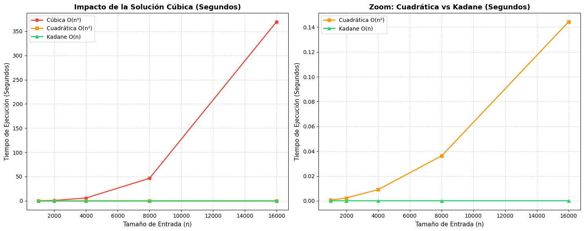

# Laboratorio 1: Análisis Empírico del Subarreglo Máximo
**Alumna :** Machacca Puma Yaquelin Liset  
**CUI:** 20204524  
**DOCENTE:** Gina

##  Entorno de Ejecución y Hardware

Las pruebas y mediciones de tiempo fueron ejecutadas bajo las siguientes especificaciones:

* **Sistema Operativo:** Arch Linux (Kernel `7.2.2-arch1-1`)
* **Lenguaje y Compilador:** C++ / `g++` (GCC 16.2.1) con bandera de optimización `-O2`
* **Procesador (CPU):** Intel® Core™ i5-4210U @ 1.70 GHz
* **Memoria RAM:** 6 GB (5.7 GiB accesibles)

---


#  Resultados Empíricos

A continuación se presentan los tiempos reales de ejecución medidos en segundos y sus respectivas razones de crecimiento T(2n)/T(n):

| n | Cúbica O(n³) (s) | Razón | Cuadrática O(n²) (s) | Razón | Kadane O(n) (s) | Razón |
|---|---|---|---|---|---|---|
| 1000 | 0.103318 | - | 0.000560 | - | 0.0000018 | - |
| 2000 | 0.748552 | 7.25 | 0.002316 | 4.13 | 0.0000035 | 1.99 |
| 4000 | 5.868780 | 7.84 | 0.009036 | 3.90 | 0.0000082 | 2.29 |
| 8000 | 46.466900 | 7.92 | 0.036225 | 4.01 | 0.0000138 | 1.68 |
| 16000 | 369.469000 | 7.95 | 0.144340 | 3.98 | 0.0000274 | 1.98 |


## Prueba de Gran Escala (n = 10⁸)
### Prueba Manual
Asumiendo el modelo:

**T(n) = c · n**
Donde c es el tiempo que le toma a la cpu procesar un solo elelmnto.

Despejamos `c`:

*c = T(16000) / 16000*

*c = 0.000028463 s / 16000*

*c ≈ 1.7789 × 10⁻⁹ s/elemento*

####  Calcular para n = 10⁸

*T(10⁸) = c · 10⁸*

*T(10⁸) = (1.7789 × 10⁻⁹) · 10⁸*

**T(10⁸) ≈ 0.1779 segundos**

### Prueba Calculada
*Al ejecutar únicamente el algoritmo de Kadane para un arreglo de 100,000,000 de elementos, el resultado fue:*
**Tiempo de ejecución de Kadane (n = 10⁸):** ~0.186 segundos.

## Comparación Teórica vs. Real

- **Resultado estimado a mano:** ≈ 0.178 segundos
- **Resultado medido en C++:** 0.185 segundos


# Justificación de Tiempos: Teórico vs. Real

El cálculo teórico asume que la memoria siempre responde a la misma velocidad, sin importar el volumen de datos (n).

En la práctica, la rapidez para leer la información depende del tipo de memoria que utilice el procesador:

* **Para n = 16,000:** El arreglo pesa solo **64 KB** y cabe por completo en la memoria caché (la más rápida de la CPU), garantizando un acceso casi inmediato.
* **Para n = 100,000,000:** El tamaño sube a unos **381 MB**, sobrepasando la capacidad de la caché y obligando al procesador a buscar los datos en la memoria RAM principal.

Leer constantemente desde la RAM genera una pequeña demora adicional. Este retraso acumulado explica por qué el tiempo real de ejecución (0.185 s) supera por apenas 0.007 s al valor ideal calculado en papel (0.178 s).

---

##  Gráfica de Rendimiento



**Interpretación del Gráfico:**

* La gráfica muestra claramente el impacto de la complejidad algorítmica en el tiempo de ejecución. El algoritmo cúbico O(n³) presenta un crecimiento muy pronunciado, alcanzando aproximadamente 378 segundos para n = 16 000, lo que demuestra que deja de ser práctico cuando el tamaño de entrada aumenta.

* En cambio, el algoritmo cuadrático O(n²) mantiene tiempos mucho menores, aunque su crecimiento también se hace evidente al aumentar n. Finalmente, Kadane O(n) presenta un tiempo prácticamente constante en comparación con los otros algoritmos, demostrando ser la alternativa más eficiente para este problema

#  Análisis Teórico vs. Empírico

Las razones experimentales T(2n)/T(n) confirman exactamente las cotas asintóticas teóricas:

* **Algoritmo Cúbico O(n³):** Al duplicar el tamaño de entrada n, el tiempo se multiplica por un factor de 2^3 = 8. La razón empírica obtenida se asienta en **~7.95**.
* **Algoritmo Cuadrático O(n²):** Al duplicar n, el tiempo se multiplica por un factor de 2^2 = 4. La razón empírica oscila en torno a **~3.94**.
* **Algoritmo de Kadane O(n):** Al duplicar n, el tiempo de ejecución se duplica 2^1 = 2. La razón empírica se estabiliza cerca de **~1.98**.

##  Compilación y Ejecución

Para compilar el proyecto aplicando optimizaciones de compilador (`-O2`), ejecuta en la terminal:

```bash
g++ -O2 MaxSubarray.cpp main.cpp -o programa 
```
Para ejecutar todas las pruebas
```bash
./programa
